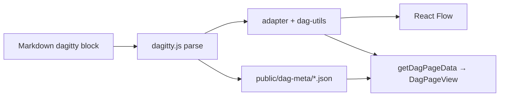

# UI stack — shadcn/ui, Tailwind, React Flow, dagitty.js

## Context and Problem Statement

DAGpedia requires two distinct types of UI:

1. **General UI** — navigation, cards, badges, forms, search dialogs
2. **DAG visualization** — interactive graph rendering with zoom, pan, and custom nodes

These have different requirements and no single library covers both well.

## Considered Options

- **Single full-stack UI framework** (e.g. one graph library for both layout and causal inference)
- **Headless component libraries** (Radix, Base UI) with custom styling
- **shadcn/ui + Tailwind** for general UI; **React Flow** for rendering; **dagitty.js** for causal inference (split stack)

## Decision Outcome

Chosen option: **shadcn/ui + Tailwind CSS + React Flow + dagitty.js**

| Layer | Library | Role |
|-------|---------|------|
| Styling | Tailwind CSS | Utility-first CSS |
| Components | shadcn/ui (Base UI primitives) | Accessible UI for panels, buttons, dialogs |
| DAG rendering | React Flow (`@xyflow/react`) | Interactive node-edge canvas (zoom, pan, drag, fullscreen) |
| Auto-layout fallback | `@dagrejs/dagre` | Left-to-right layout when dagitty source has no `pos=` coordinates |
| Causal inference | dagitty.js (vendored) | Parse DAG, adjustment sets, conditional independencies |
| Node runtime for dagitty | jsdom + `vm` | Run vendored dagitty.js at build time and in `getDagPageData` (SSR/SSG) |
| Content parsing | gray-matter + Zod | Markdown frontmatter validation (`dag-page.ts`) |

**Division of responsibility:**

- **dagitty.js** is the causal reasoning engine: it parses DAG definitions and computes
  adjustment sets, d-separation statements, and implied conditional independencies.
  It is not used for rendering.
- **React Flow** is the rendering engine: it displays nodes and edges interactively.
  It has no knowledge of causal inference.
- An **adapter layer** under `src/lib/dagitty/` plus `src/lib/dag-utils.ts` converts
  dagitty output into app types (`DagNode`, `DagEdge`) and React Flow `nodes[]` / `edges[]`.

**Why shadcn/ui over alternatives:** copies components into the project (no black-box dependency),
built on Radix UI primitives, works with Tailwind natively, and does not require Base UI.

## Implementation (as built)

### Module map

| Module | Role |
|--------|------|
| `src/lib/dagitty/runtime.ts` | Load `public/vendor/dagitty.js` — browser via `globalThis`, Node via jsdom `runInContext` |
| `src/lib/dagitty/adapter.ts` | `GraphParser.parseGuess` → nodes, edges, optional `layout_pos_*` |
| `src/lib/dagitty/analyze.ts` | `computeDagMeta()` — MSAs and conditional independencies |
| `src/lib/dag-utils.ts` | Build `DagNode` / `DagEdge`, role inference, evidence helpers |
| `src/components/dag-display/DagCanvas.tsx` | React Flow canvas for DAG pages |
| `src/components/dag-display/layout-dag.ts` | dagre LR layout when no explicit coordinates |
| `src/components/dag-display/PreserveViewportCenter.tsx` | Keep viewport center fixed on container resize |
| `scripts/generate-dag-meta.ts` | Emit `public/dag-meta/[slug].json` at prebuild |

Operational detail for the adapter (coordinate scale, verification commands) lives in
[`docs/conventions/dagitty-react-flow-adapter.md`](../conventions/dagitty-react-flow-adapter.md).

### Data flow (DAG pages)



1. **Structure** — `getDagPageData()` reads the dagitty block, parses via dagitty.js, builds
   nodes/edges for React Flow. Edge evidence may come from YAML `edges:` when present.
2. **Causal metadata** — `npm run generate-dag-meta` (runs in `prebuild`) writes adjustment sets
   and conditional independencies to JSON. Pages read `public/dag-meta/[slug].json`; do not
   hand-write these fields in frontmatter.
3. **Layout** — If every vertex has dagitty layout coordinates (`pos="x,y"`), React Flow uses
   them (scaled by `LAYOUT_SCALE` in `adapter.ts`). Otherwise dagre assigns positions.

### Role assignment precedence

1. Dagitty `[exposure]` / `[outcome]` tags (`isSource` / `isTarget`)
2. Other role tags (`mediator`, `covariate`, etc.)
3. Path-based inference in `inferNodeRoles()` when untagged

### DAG page canvas UX

Implemented in `DagPageView` + `DagCanvas` (not the legacy inline renderer):

| Feature | Mechanism |
|---------|-----------|
| Node drag | React Flow `useNodesState` + `onNodesChange` (positions kept in client state) |
| Pan / zoom | React Flow defaults; Controls panel |
| Resize panels | shadcn `Resizable` ([react-resizable-panels](https://github.com/bvaughn/react-resizable-panels)) — horizontal split + vertical canvas/list split |
| Center on resize | `PreserveViewportCenter` — `ResizeObserver` adjusts viewport so the same flow point stays centered |
| Full screen | Fullscreen API on the canvas container; toggle in top-right panel |
| Initial framing | `fitView` once in `onInit` (not on every resize) |

Edge stroke uses CSS variables directly (`var(--muted-foreground)`), not `hsl(var(...))`,
because theme tokens are oklch.

### Two rendering paths

| Context | Component | Engine |
|---------|-----------|--------|
| DAG detail page (`/dags/[slug]`) | `DagCanvas` | React Flow + adapter |
| Markdown body ` ```dagitty ` blocks | `DagViewer` | Native dagitty.js canvas (`useDagitty.ts`) |

DAG pages are the primary, maintained path. Inline markdown blocks keep the legacy dagitty
renderer for prose-embedded figures until/unless unified.

### Consequences

- Good: Clear separation between visualization and causal reasoning logic
- Good: React Flow handles complex UX (zoom, pan, drag) out of the box
- Good: shadcn/ui components are fully customizable without fighting the library
- Bad: Two graph-related libraries (React Flow + dagitty.js) must be kept in sync via the adapter
- Bad: dagitty.js TypeScript types are weak; type assertions may be needed
- Bad: jsdom adds a production dependency and ~5s cold-start cost for first server-side parse
- Bad: Two renderers (React Flow vs inline `DagViewer`) can diverge visually

## References

- [shadcn/ui](https://ui.shadcn.com/)
- [React Flow](https://reactflow.dev/)
- [dagitty.js](https://dagitty.net/dagitty.js)
- [dagre](https://github.com/dagrejs/dagre)
- [Adapter conventions](../conventions/dagitty-react-flow-adapter.md)
